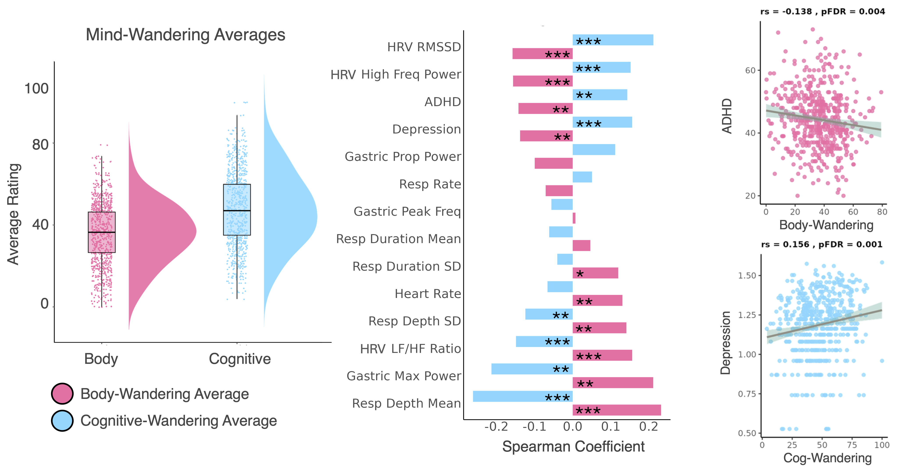

# Body-wandering reveals an embodied dimension of thought with distinct affective and neural signatures

Leah Banellis, Niia Nikolova, Malthe Brændholdt, Melina Vejlø, Francesca Fardo, Jonathan Smallwood, Micah G. Allen

---

## Abstract

Humans often engage in self-generated thoughts when unoccupied by external events, a phenomenon commonly known as mind-wandering. Previous research has predominantly focused on the cognitive aspects of mind-wandering, overlooking the potential embodied or interoceptive components that contribute to our ongoing thought patterns. In this study, we addressed this gap by exploring “body-wandering”—thoughts related to internal bodily sensations such as breathing, heartbeat, and gastrointestinal functions. To assess body-wandering, we applied a retrospective multi-dimensional interoceptive experience sampling approach in 536 healthy participants concurrently with resting-state functional brain imaging. Our findings revealed that body-wandering is distinct from cognitively focused thoughts, underscoring the unique role of embodied processes in ongoing experience. Embodied thought patterns were associated with increased negative affect, heightened physiological arousal, and reduced ADHD symptoms. In contrast, cognitive-focused thoughts were linked to decreased negative affect, lower arousal, and higher depression symptoms. Notably, body-wandering corresponded with a unique neural signature involving increased connectivity between somatomotor, interoceptive, and thalamocortical brain networks. These results emphasise the importance of incorporating embodied processes into theoretical models of mind-wandering and suggest that individual differences in body-wandering significantly impact emotional states and mental health.

---

## Preprint

Access the preprint here: [https://www.biorxiv.org/content/10.1101/2024.10.25.620252v2.full](https://www.biorxiv.org/content/10.1101/2024.10.25.620252v2.full)

---

## Citation

> Banellis, L., Nikolova, N., Brændholdt, M., Vejlø, M., Fardo, F., Smallwood, J., & Allen, M. G. (2024). Body-wandering reveals an embodied dimension of thought with distinct affective and neural signatures. *bioRxiv*, 2024-10.

# Scripts for Body-Wandering Analyses

Note: data & scripts for raw/preprocessed fMRI, raw physio, and raw survey individual subject data stored in Visceral Mind Project BIDS structure:  

**1. Body/Mind-Wandering Item-level Analyses**:  
    BodyWanderingCCA/scripts/body_wandering_itemplots.Rmd
      

**2. Network Analysis of Body/Mind-Wandering Items**:  
    BodyWanderingCCA/scripts/body_wandering_Network.Rmd

**3. Mental Health and Physiological Relationships with Body/Cognitive-Wandering Averages**:  
    /BodyWanderingCCA/scripts/Correlations_MindWandAverages.Rmd

--------------------------------------------------------------------------------------------------------

**4. Cortical Fingerprinting of Body-Wandering via CCA**:

    4a. Create matched input matrices for CCA (X = Brain Connectivity, Y = Body/Mind-Wandering Items, C = Confounds):  
    /BodyWanderingCCA/scripts/CCA/CCAprepData.m

    4b. X.mat, Y.mat & C.mat from (4a.) saved in:  
    '/BodyWanderingCCA/scripts/CCA/cca_pls_toolkit-master/_Project_BodyWandering/data/', 
    and framework folder created:  
    '/BodyWanderingCCA/scripts/CCA/cca_pls_toolkit-master/_Project_BodyWandering/framework/'  

    4c. Run CCA with CCA/PLS toolkit (run on cluster via BodyWanderingCCA/scripts/CCA/cca_pls_toolkit-master/cca_jobs_slurm.sh):  
    BodyWanderingCCA/scripts/CCA/cca_pls_toolkit-master/RunCCA.m

    4d. Plot CCA result (variate scatterplot, body/mind-wandering loading barplot & wordcloud, extraction of cca mode result details):  
    BodyWanderingCCA/scripts/CCA/cca_pls_toolkit-master/CCA_plots.m

    4e. Plot CCA result: connectivity loadings via Chordplot:
    /BodyWanderingCCA/scripts/CCA/CCA_plots.Rmd
     
    4f: Plot CCA result: connectivity loading sums projected on Schaefer-Subcortical216 parcellated brain (save nifti to plot with MRIcroGL):  
    /BodyWanderingCCA/scripts/CCA/CCA_Brain_Figures_abend.ipynb

--------------------------------------------------------------------------------------------------------

**5. Gradient Association of CCA Result**:

    5a. Create gradient-averages per Schaefer-Subcortical216 parcellated brain regions (store parcel numbers & labels):
    /BodyWanderingCCA/scripts/Gradients/gradients.ipynb

    5b. Convert Schaefer-Subcortical216 atlas to surface space using the freesurfer function ‘mri_vol2surf’ :
    /BodyWanderingCCA/scripts/Gradients/gradient2surface.sh

    5c. Gradient averages for top 1% regions from CCA & Spin test for creating null distribution (Need toolbox: https://github.com/spin-test/spin-test and FreeSurfer: https://surfer.nmr.mgh.harvard.edu/fswiki/DownloadAndInstall):
    /BodyWanderingCCA/scripts/Gradients/SpinPermuFS_LB.m

    5d. Statistics and plots:
    /BodyWanderingCCA/scripts/Gradients/SpinTestResults_AverageTopCCA.m

--------------------------------------------------------------------------------------------------------

### Extra scripts for plots and JASP statistics:

Wordclouds of Mind-Wandering Summary Scores:
    /BodyWanderingCCA/scripts/ExtraPlots/wordcloud.m

Multiple Linear Regressions of Body/Cognitive-Wandering Average Relationships, Patial Correlations, and Wilcoxon Tests (had to hide currently due to protected mental health data - will be released with Visceral Mind Project): 
    /BodyWanderingCCA/data/JASP/BodyWanderingStats.jasp
